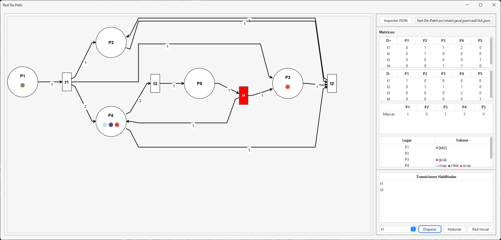
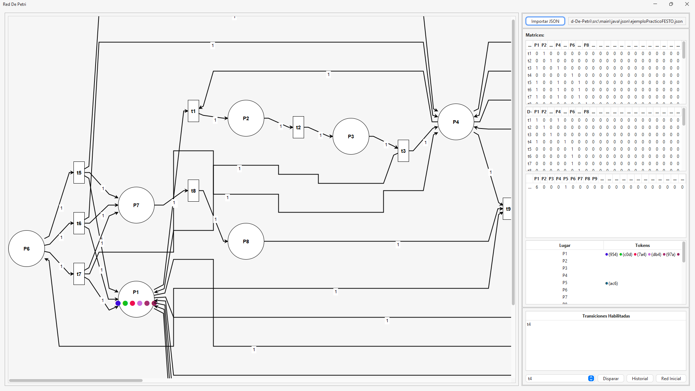

# Proyecto de Red de Petri

## Autor

- Nombre del Autor: Daniel David Arias Monroy

Este proyecto es una aplicación Java que simula una red de Petri. Incluye componentes de backend para la lógica de la red y frontend para la interfaz de usuario.

## Estructura del Proyecto

- backend: Contiene la lógica del servidor y las clases de negocio.
- frontend: Contiene las clases relacionadas con la interfaz de usuario.
- json: Manejo de archivos JSON y serialización/deserialización.

## Requisitos

- Java 8 o superior
- Apache Maven

## Pruebas de ejecución
### Red ejemplo

### Red ejemplo practico

